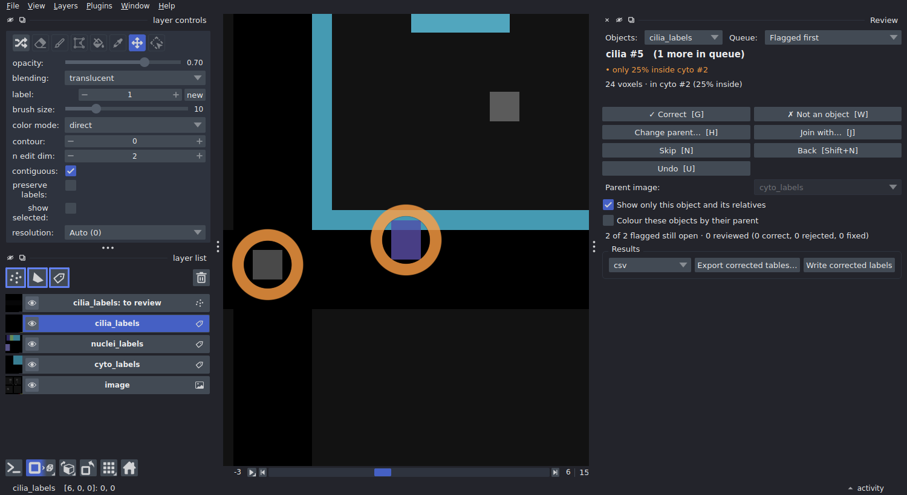
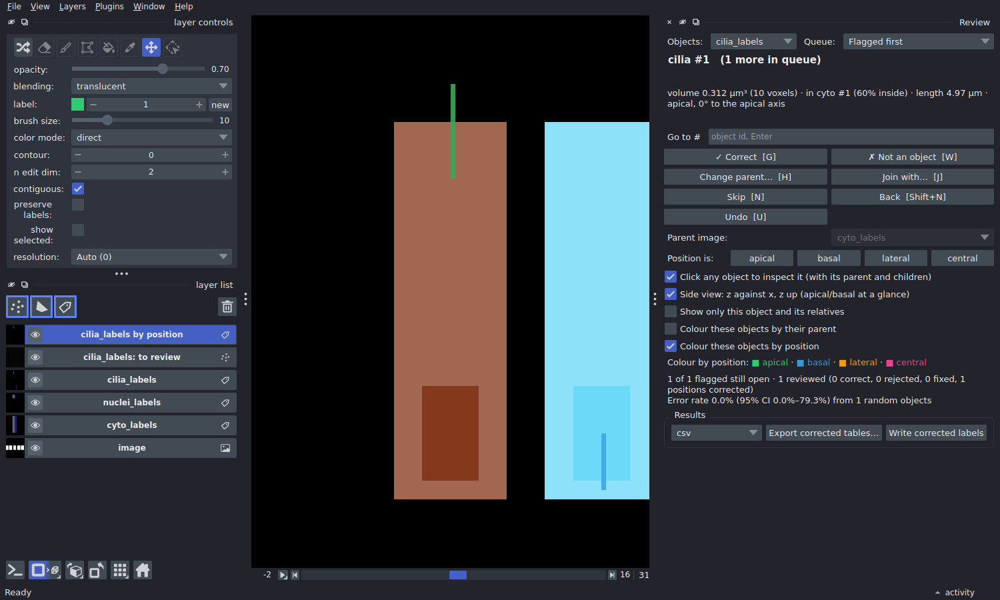

# Reviewing and correcting results

A segmentation of a whole tissue has tens of thousands of objects, and some
of them are wrong. Scrolling through the volume hoping to spot them doesn't
work. `patchworks review` shows you the objects **most likely to be wrong**,
one at a time, and lets you fix each one with a single key. Your
corrections go straight into the result tables and workbooks, and no voxel
is rewritten unless you ask.

```bash
pip install "patchworks[napari]"      # on the machine you review on
patchworks review results/image.zarr
```



*A cilium only 25% inside its cell. The view jumps to it, shows it with its
cell outlined, and hides everything else. Press G if it is right, H to give
it the right cell, W if it isn't a cilium at all.*

## What gets flagged

Each object in the queue shows why it is there:

| Flag | Means | Typical cause |
| --- | --- | --- |
| *not inside any cell* | the object overlaps no parent object | debris, a missed cell, a cilium on the lumen side |
| *only 30% inside cell #88* | less than `min_overlap` of it is inside its parent | wrong cell picked at a boundary, or a merge of two objects |
| *0 nuclei (expected 1)* | a parent holds an unexpected number of children | a cell split in two, two cells merged, a missed nucleus |
| *meets #412 exactly at a tile seam (z)* | two objects touch face to face on a tile boundary | one object the tiling cut in two, or two neighbours; press J to join them |
| *unusually large (6.2x the median)* | the size is far from the rest (robust z-score > 3.5) | two objects merged, or a fragment |
| *outside cell #12, 0.8 µm away* | touches no parent, but one is within `max_distance_um` | a cilium beside its cell (worth a look, lower priority) |
| *position unclear: its cell has no nucleus to orient it* | a position rule needs the nucleus, and the cell has none | a missed nucleus, or a cell cut by the image edge |

The most suspicious objects come first. "Children" and "parents" come from
the relations of a multi run (e.g. `cilia_labels → cyto_labels`); the size
and seam flags apply to every label image.

**Expected counts** are yours to state, since only you know that a cell has
one nucleus and zero to two cilia. Put them in `multi.yaml`, and the
workflow checks them before it starts and stores them with the results:

```yaml
review:
  expect:
    cyto_labels:
      nuclei_labels: 1         # exactly one
      cilia_labels: [0, 2]     # zero to two
  min_overlap: 0.5             # or per pair: {cilia_labels: {cyto_labels: 0.3}}
```

Or pass them when you open the review:
`patchworks review image.zarr --expect cyto_labels:nuclei_labels=1 cyto_labels:cilia_labels=0-2`.

## Deciding

| Key | Decision | Effect on the results |
| --- | --- | --- |
| **G** | correct as it is | kept; marked `ok` |
| **W** | wrong: not a real object | dropped from every table and count |
| **H**, then click | belongs to another parent: click the right one (the background means "none") | its parent id changes; both parents' counts follow |
| **J** | join with the suggested object (a seam split) | the two become one object: sizes added, centroid and intensities weighted |
| **Shift+J**, then click | join with the object you click | same |
| **N** / **Shift+N** | skip / go back | nothing |
| **U** | undo the decision about this object | back to unreviewed |

Every decision is saved immediately, in the store, next to the object
table. Close napari whenever you like: the next `patchworks review`
continues where you stopped, and the queue leaves out what has been
decided. Corrections chain as you would expect. For example, joining two
halves of a cell moves the cilia of both halves to the joined cell.

## Seeing what belongs to what

Outside the queue, you can look at any object:

- **Click any object** in the image: the panel switches to it and shows it
  with its parent (outlined) and its children. Click a cell to see its
  nuclei and cilia, a cilium to see its cell. A click reads the image at
  full resolution, and a thin object is hit even a couple of voxels off,
  so cilia are easy to pick.
- **Go to #**: type an object's id and press Enter.
- **Hover** over any object: napari's status bar shows its parent, its
  number of children, its position and its review status.

Options in the panel change the view:

- **Show only this object and its relatives** (on by default) hides
  everything else. Untick it to see the neighbourhood.
- **Colour these objects by their parent** adds a layer where every child
  has its parent's colour: all cilia of one cell share a colour, so an
  assignment error stands out as a different colour.
- **Colour these objects by position** colours each cilium by its class:
  apical, basal, lateral or central.
- **Side view** shows z against x, with z up, through the object. Apical
  and basal are then seen at a glance.

Orange rings mark the flagged objects still open. They stay visible in 3D,
where napari's coarse 3D level hides small objects.

## Where a cilium sits: apical, basal, lateral, central



*Side view, coloured by position: an apical cilium (green) standing out of
the top of its cell, the nucleus at the bottom; next door, a basal cilium
(blue).*

Each cilium is classified by the cell surface its **base** is nearest to:

| Class | The base is nearest to |
| --- | --- |
| `apical` | the top of the cell |
| `basal` | the bottom of the cell |
| `lateral` | the side wall |
| `central` | none of them: deeper than half-way from every surface |

"Top" needs an apical direction per cell. It can be a fixed direction:
`+z` if apical is up the stack, as for a monolayer imaged from below. Or it
can point **away from the nucleus**, for epithelia whose nuclei sit
basally; then each cell gets its own axis, whatever its tilt. The base of
a cilium is its end nearer the cell's centre, since a cilium grows out
from its base.

```yaml
# multi.yaml
review:
  position:
    cilia_labels:
      parent: cyto_labels
      apical: nuclei_labels     # away from the nucleus; or "+z", "-z", ...
      central_depth: 0.5        # optional
```

Or when opening the review:
`patchworks review image.zarr --position cilia_labels:cyto_labels=nuclei_labels`.

The corrected tables get the class (`position`), where the base sits
(`position_axial`: -1 basal … +1 apical; `position_radial`: 0 on the axis …
1 at the side) and the cilium's angle to the apical axis
(`angle_to_axis_deg`: 0 along it, 90 across it). Each cell gets its counts
per class (`n_cilia_labels_apical`, …), as does the relation workbook.

The cell's shape comes from its moments, i.e. an equivalent cylinder, so
this is a classification, not a surface distance. It is reliable for
columnar and cuboidal cells, and less so for very irregular ones. Check it
the usual way: **Colour these objects by position** plus **Side view**. If
one is wrong, the **Position is:** buttons correct it. A correction counts
as a classification fix, not a segmentation error, so it does not enter
the error rate. A cell without a nucleus cannot be oriented; its cilia are
`unknown` and flagged.

## Cilia next to their cell, not on it

A cilium can lie against its cell without overlapping it, and would then
count as belonging to no cell. With `max_distance_um` on a relation, such
an object gets the **nearest** cell within that distance. The distance is
exact, in µm, with anisotropic voxels taken into account, and is recorded
in `cyto_labels_distance_um`. These objects are flagged with a lower
priority ("outside cell #12, 0.8 µm away").

```yaml
relations:
- a: cilia_labels
  b: cyto_labels
  output: cilia_to_cell.xlsx
  max_distance_um: 1.0
```

For an existing store:
`patchworks tables image.zarr --relate cilia_labels:cyto_labels --max-distance 1`.

## How good is the segmentation?

Pick the queue **Random sample (error rate)** and review objects in the
order it gives. The panel reports the fraction found wrong, with a 95%
confidence interval, e.g. *Error rate 3.0% (95% CI 1.0–8.5%) from 100
random objects*. Stop when the interval is narrow enough for what you need.
The estimate is unbiased because the order is random and fixed. Objects you
already decided from the flagged queue count too: a decision about an
object is true however it came up.

## Using the corrections

The workbooks and tables are always read *with* the decisions applied:

- **The relation workbooks** of a multi run:
  `patchworks review image.zarr --workbooks results/` writes every one
  (`<child>_to_<parent>.xlsx`) from the corrected tables, with a `qc`
  column (`ok`, `fixed`, or blank if not reviewed). Re-running the same
  `run_multi` command does it too: a workbook older than your decisions is
  rewritten, straight from the tables, without re-reading any labels.
- **Export** the corrected tables, one file per label image, from the
  panel or with `patchworks review image.zarr --export results/tables
  --format xlsx` (or `csv`, `parquet`). A csv loads straight into
  [napari-chunked-regionprops](measurements.md) ("Reload previous
  results").
- **Write corrected labels** (panel button, or `--write-labels
  nuclei_labels`) writes `labels/nuclei_labels_reviewed`, the label image
  with the decisions applied to the voxels. You only need this for figures,
  or for tools that read label images only.

`patchworks review image.zarr --summary` prints the counts and the error
estimate without opening napari.

## Where the tables come from

Every label image the workflow writes gets an **object table**: one row per
object with its size (`area_voxels`, `area_um3`), centroid, bounding box,
its spread (`cov_*`, the second moments) and, for a multi run, the parent
it sits in (`cyto_labels_id`, `cyto_labels_overlap`). The corrected view
adds each object's shape from its spread: `length_um` (for a straight rod
the true length; shorter for a curved one), `elongation` (1 round, large
rod-like) and its main axis (`axis_z`, `axis_y`, `axis_x`). The table lives
inside the label group:

```text
image.zarr/labels/cilia_labels/
  0/ 1/ 2/ …     the label pyramid
  table/         the object table (one zarr array per column)
```

So it travels with the labels, including in a zip bundle, and it is
replaced whenever the labels are. A table computed from older labels is
recognised and ignored, never shown against the wrong segmentation.
The table costs no extra read of the labels: each segment job measures
its tiles' objects as it writes them, and the merge adds those sums up per
merged object (an object cut by tile boundaries gets exactly the values it
would have measured whole). Intensity columns (`table_channels: [0, 2]`)
need the image, so with them the merged labels are measured once instead.
Turn tables off with `object_table: false` (see the
[workflow config](snakemake.md)).

For a store that has none, for example a run made before tables existed,
or labels from elsewhere:

```bash
patchworks tables image.zarr --relate nuclei_labels:cyto_labels cilia_labels:cyto_labels
```

In Python:

```python
from patchworks import Review, read_table

cells = read_table("image.zarr/labels/cyto_labels")      # pandas, as computed
rv = Review("image.zarr", expect={"cyto_labels": {"nuclei_labels": 1}})
rv.flags("cyto_labels")[:5]                               # the worst five
rv.decide("nuclei_labels", 17, "wrong")
rv.effective("cyto_labels")                               # with corrections
```

## Where to review

On any machine with a screen and napari, reading the store the cluster
wrote:

- **Copy the store** to your computer (tables and decisions live in it), or
  open it on a mounted cluster filesystem. napari reads only what is on
  screen, so a network mount works.
- The store must be **writable**, since that is where the decisions are
  saved. A `.zip` bundle is read-only, so unzip it first.
- The decisions are small. If you reviewed a copy, `--workbooks` and
  `--export` work on that copy directly; there is no need to copy anything
  back.
